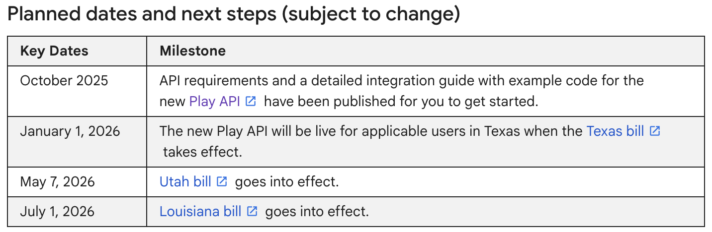

<a href="https://gauthamvijay.com">
  <picture>
    
  </picture>
</a>

# react-native-play-age-signals

A **React Native TurboModule** that provides a bridge to the **Google Play Age Signals API**, enabling Android apps to query **user supervision and age verification status** when available via Play Services.

[!IMPORTANT]
- The Play Age Signals SDK (`com.google.android.play:age-signals`) is currently in **beta** and **not yet fully implemented** by Google.  
- Calling `checkAgeSignals()` will currently throw: java.lang.UnsupportedOperationException: Not yet implemented
- This library is ready and production-safe — it will begin returning real data **automatically** once Google enables the API in upcoming Play Services updates.

---

## 📦 Installation

```tsx
npm install react-native-play-age-signals
```

### 🚀 Zero Config Setup

* **No manual native setup required.**
  This library uses **React Native TurboModules**, so it works out of the box with autolinking — even inside **Expo apps (custom dev clients)**.
* Supports **React Native 0.72+**.

---

## 🔗 Reference Links

* 📘 Google Developer Docs: [Play Age Signals](https://developer.android.com/google/play/age-signals/use-age-signals-api)
* 🧾 Google Support: [Age-Appropriate Ads Requirements](https://support.google.com/googleplay/android-developer/answer/16569691)

---

## 🇺🇸 Why this library exists

This module was built for **production use** in my work app (US-based), where new **state-level legislation** requires mobile apps to verify the user’s age before displaying certain content or ads.

To help other developers comply with these same laws, I’ve **open-sourced** it here.

> The **Google Play Age Signals API** will be the official, privacy-safe method to determine user supervision and age verification status across Android devices in the United States.

---

<a href="https://gauthamvijay.com">
  <picture>
    
  </picture>
</a>

---

## 🧠 What It Does

Once the Play Services feature is live, the module will expose the following fields via `getPlayAgeSignals()`:

```
{
  installId: string | null;
  userStatus: string | null;
  error?: string | null;
}
```

Example (future API result):

```
{
  "installId": "123e4567-e89b-12d3-a456-426614174000",
  "userStatus": "VERIFIED"
}
```

---

## ⚙️ Usage

```
import { getPlayAgeSignals } from 'react-native-play-age-signals';
import { useEffect } from 'react';
import { Text, View } from 'react-native';

export default function App() {
  useEffect(() => {
    const fetchSignals = async () => {
      try {
        const result = await getPlayAgeSignals();
        console.log('Play Age Signals:', result);
      } catch (error) {
        console.error('Failed to fetch Play Age Signals:', error);
      }
    };

    fetchSignals();
  }, []);

  return (
    <View>
      <Text>Check your logs for Play Age Signals output</Text>
    </View>
  );
}
```

---

## 🧩 Supported Platforms

| Platform                          | Status                               |
| --------------------------------- | ------------------------------------ |
| **Android**                       | ✅ Supported (pending SDK activation) |
| **iOS**                           | 🚫 Not applicable (returns `null`)   |
| **Expo (Custom Dev Client)**      | ✅ Works out of the box               |
| **AOSP Emulator (no Play Store)** | ⚠️ Not supported                     |

---

## 🛠️ Under the Hood

This library uses:

```
AgeSignalsManagerFactory.create(context)
  .checkAgeSignals(AgeSignalsRequest.builder().build())
```

to connect to the Play Services API through a native Kotlin TurboModule and forward results to JavaScript with full error propagation and stack traces.

---

## 📅 Roadmap

* ✅ TurboModule bridge implementation
* ✅ Error handling with full Java → JS stack propagation
* 🚧 Awaiting Play Services rollout of working backend
* 🔔 Auto-watch for new SDK versions via Dependabot and GitHub Actions

---

## 🤝 Contributing

Pull requests are welcome — especially once Google enables this API!

* [Development workflow](CONTRIBUTING.md#development-workflow)
* [Sending a pull request](CONTRIBUTING.md#sending-a-pull-request)
* [Code of conduct](CODE_OF_CONDUCT.md)

---

## 🪪 License

MIT © [Gautham Vijayan](https://gauthamvijay.com)

---

Made with [create-react-native-library](https://github.com/callstack/react-native-builder-bob)

---
