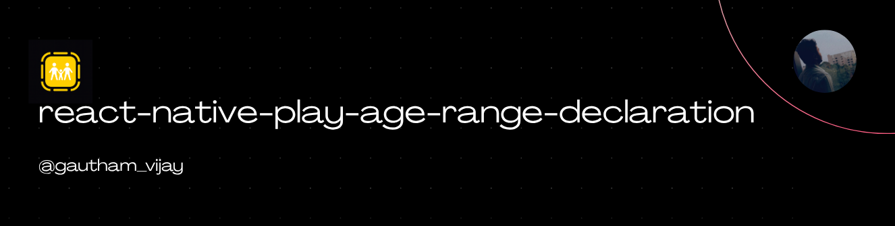
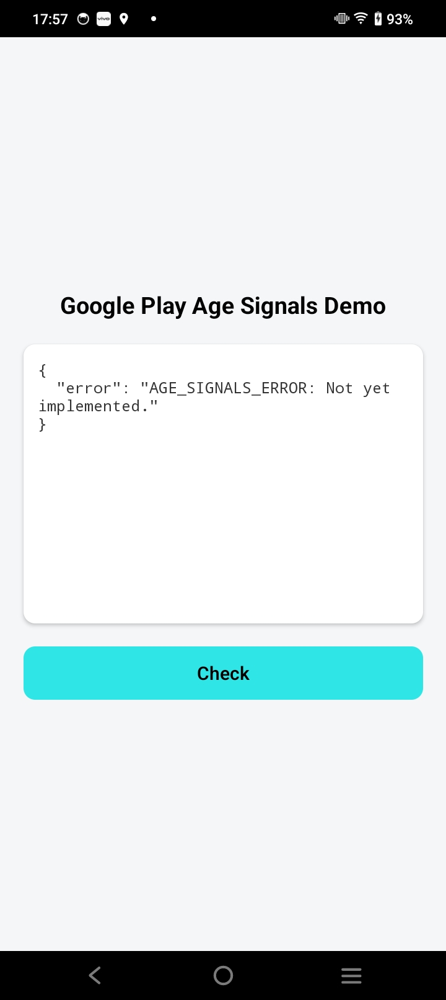

<a href="https://gauthamvijay.com">
  <picture>
    
  </picture>
</a>

# react-native-play-age-range-declaration (Beta)

A **React Native Nitro Module** providing a unified API for **age-appropriate experiences** across platforms — bridging:

- 🟢 **Google Play Age Signals API** (Android)
- 🔵 **Apple Declared Age Range API** (iOS 26+)

---

> [!IMPORTANT]
>
> - Need testers for testing the library in a production based app with Android 15 or Android 16 and above!
> - The APIs for Google Play Age Signals are returning "Not Yet Implemented" as of Nov 2025 for my app tested in my Android 14 device powered device which I bought in 2022.

---

## 📦 Installation

```bash
npm install react-native-play-age-range-declaration react-native-nitro-modules
```

> [!NOTE]
>
> - The APIs for Apple's Declared Age Range works in iOS 26 as I have tested in real device and I have attached a video showing the workings of it.

## Demo

<table>
  <tr>
    <th align="center">🍏 iOS Demo</th>
    <th align="center">🤖 Android Demo</th>
  </tr>
  <tr>
    <td align="center">
      <video src="https://github.com/user-attachments/assets/5fa5c82d-054c-46a2-bfec-4a0b4398576f" height="650" width="300" controls></video>
    </td>
    <td align="center">
     
    </td>
  </tr>
</table>

---

## 🧠 Overview

| Platform    | API Used                                                     | Purpose                                            |
| ----------- | ------------------------------------------------------------ | -------------------------------------------------- |
| **Android** | Play Age Signals API (`com.google.android.play:age-signals`) | Detect user supervision / verified status          |
| **iOS**     | Declared Age Range API (`AgeRangeService.requestAgeRange`)   | Get user’s declared age range (e.g., 13–15, 16–17) |

---

## Configuration

iOS: Add the below entitlement to your project:

com.apple.developer.declared-age-range

Android: No extra configuration needed, but for this API to work, you have to have play console installed in your android device.

---

## ⚙️ Usage

```tsx
import { useState } from 'react';
import {
  Text,
  View,
  StyleSheet,
  ActivityIndicator,
  ScrollView,
  Platform,
  Pressable,
} from 'react-native';

import {
  getAndroidPlayAgeRangeStatus,
  getAppleDeclaredAgeRangeStatus,
  type PlayAgeRangeDeclarationResult,
  type DeclaredAgeRangeResult,
  PlayAgeRangeDeclarationUserStatusString,
  PlayAgeRangeDeclarationUserStatus,
} from 'react-native-play-age-range-declaration';

export default function App() {
  const [androidResult, setAndroidResult] =
    useState<PlayAgeRangeDeclarationResult | null>(null);

  const [appleResult, setAppleResult] = useState<DeclaredAgeRangeResult | null>(
    null
  );

  const [error, setError] = useState<string | null>(null);
  const [loading, setLoading] = useState(true);

  const fetchStatus = async () => {
    try {
      setLoading(true);

      setError(null);

      if (Platform.OS === 'android') {
        const data = await getAndroidPlayAgeRangeStatus();

        setAndroidResult(data);
      } else {
        const data = await getAppleDeclaredAgeRangeStatus(10, 13, 16);

        setAppleResult(data);
      }
    } catch (err: any) {
      console.error('❌ Failed to fetch Age Signals:', err);
      const msg =
        err?.message ??
        err?.nativeStackAndroid ??
        'Unknown error retrieving Play Age Signals';
      setError(msg);
    } finally {
      setLoading(false);
    }
  };

  const title =
    Platform.OS === 'ios'
      ? 'Apple Declared Age Range Demo'
      : 'Google Play Age Signals Demo';

  return (
    <View style={styles.container}>
      <Text style={styles.header}>{title}</Text>

      {loading ? (
        <ActivityIndicator size="large" color="#007aff" />
      ) : error ? (
        <View style={styles.errorBox}>
          <Text style={styles.errorTitle}>Error</Text>
          <Text style={styles.errorText}>{error}</Text>
        </View>
      ) : (
        <ScrollView style={styles.resultBox}>
          {Platform.OS === 'ios' ? (
            <Text style={styles.resultText}>
              Status: {appleResult ? appleResult?.status : ''} {`\n`}
              ParentControls: {appleResult
                ? appleResult?.parentControls
                : ''}{' '}
              {`\n`}
              Lower Bound: {appleResult ? appleResult?.lowerBound : ''} {`\n`}
            </Text>
          ) : (
            <Text style={styles.resultText}>
              Install Id: {androidResult ? androidResult?.installId : ''} {`\n`}
              User Status: {androidResult ? PlayAgeRangeDeclarationUserStatusString[androidResult?.userStatus as PlayAgeRangeDeclarationUserStatus] : ''} {`\n`}
              Most Recent Approval Date: {androidResult ? androidResult?.mostRecentApprovalDate : ''} {`\n`}
              Age Lower: {androidResult ? androidResult?.ageLower : ''} {`\n`}
              Age Upper: {androidResult ? androidResult?.ageUpper : ''} {`\n`}
            </Text>
          )}
        </ScrollView>
      )}

      <Pressable style={styles.button} onPress={fetchStatus}>
        <Text style={styles.buttonTitle}>Check</Text>
      </Pressable>
    </View>
  );
}

const styles = StyleSheet.create({
  container: {
    flex: 1,
    padding: 20,
    backgroundColor: '#f4f6f8',
    alignItems: 'center',
    justifyContent: 'center',
  },
  header: {
    fontSize: 20,
    fontWeight: '700',
    marginBottom: 20,
  },
  resultBox: {
    maxHeight: 240,
    width: '100%',
    backgroundColor: '#fff',
    borderRadius: 10,
    padding: 12,
    shadowColor: '#000',
    shadowOpacity: 0.1,
    shadowOffset: { width: 0, height: 2 },
    shadowRadius: 6,
    elevation: 2,
  },
  resultText: {
    fontFamily: Platform.select({ ios: 'Menlo', android: 'monospace' }),
    fontSize: 13,
    color: '#333',
  },

  button: {
    backgroundColor: '#2fe5e5',
    borderRadius: 10,
    padding: 12,
    width: '100%',
    justifyContent: 'center',
    alignItems: 'center',
    marginTop: 20,
  },

  buttonTitle: {
    fontSize: 16,
    fontWeight: '600',
    color: 'black',
  },

  errorBox: {
    backgroundColor: '#ffe5e5',
    borderRadius: 10,
    padding: 12,
    width: '100%',
  },
  errorTitle: {
    fontSize: 16,
    fontWeight: '600',
    color: '#b00020',
    marginBottom: 4,
  },
  errorText: {
    color: '#b00020',
    fontSize: 14,
  },
});
```

---

## 🧩 Supported Platforms

| Platform          | Status                  |
| ----------------- | ----------------------- |
| **Android**       | ✅ Supported (SDK Beta) |
| **iOS 26+**       | ✅ Supported            |
| **iOS Simulator** | ⚠️ Not supported        |
| **AOSP Emulator** | ⚠️ Not supported        |

---

## 🤝 Contributing

Pull requests welcome!

- [Development Workflow](CONTRIBUTING.md#development-workflow)
- [Sending a PR](CONTRIBUTING.md#sending-a-pull-request)
- [Code of Conduct](CODE_OF_CONDUCT.md)

---

## 🪪 License

MIT © [**Gautham Vijayan**](https://gauthamvijay.com)

---

Made with ❤️ and [**Nitro Modules**](https://nitro.margelo.com)
