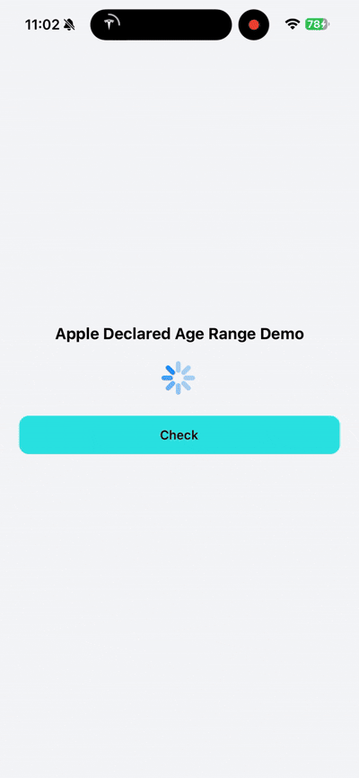
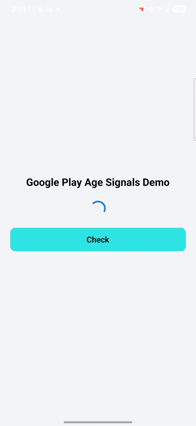

<a href="https://gauthamvijay.com">
  <picture>
    
  </picture>
</a>

# react-native-play-age-range-declaration

A **React Native Nitro Module** providing a unified API for **age-appropriate experiences** across platforms — bridging:

- 🟢 **Google Play Age Signals API** (Android)
- 🟠 **Amazon Appstore GetUserAgeData API** (Android)
- 🟣 **Samsung Galaxy Store Age Signals API** (Android)
- 🔵 **Apple Declared Age Range API** (iOS 26+)

---

> [!IMPORTANT]
>
> - Works in both Expo & Bare (Non Expo) React Native projects.

---

## 📦 Installation

```bash
npm install react-native-play-age-range-declaration react-native-nitro-modules
```

> [!NOTE]
>
> - Apple's Declared Age Range API requires **iOS 26+**; Google Play Age Signals requires **Android 15+** with the Play Store installed (both tested on real devices — see the demos below).
> - Amazon Appstore and Samsung Galaxy Store age signals respond when the app is installed from that store. Every store can also be **mocked from JS** for development — see [TESTING_ANDROID.md](TESTING_ANDROID.md).

## Demo

<!-- TODO: Re-record demo videos to show the Android store selector (Google Play / Amazon / Samsung) and mock scenarios. Replace the GIFs below, keeping the same paths. -->

<table>
  <tr>
    <th align="center">🍏 iOS Demo</th>
    <th align="center">🤖 Android Demo</th>
  </tr>
  <tr>
    <td align="center">
    
    </td>
    <td align="center">
     
    </td>
  </tr>
</table>

---

## 🧠 Overview

| Store                    | API Used                                                     | Purpose                                            |
| ------------------------ | ------------------------------------------------------------ | -------------------------------------------------- |
| **Google Play**          | Play Age Signals API (`com.google.android.play:age-signals`) | Detect user supervision / verified status          |
| **Amazon Appstore**      | `GetUserAgeData` ContentProvider                              | Age range + parental-consent status                |
| **Samsung Galaxy Store** | ASAA `getAgeSignalResult` ContentProvider                     | Detect user supervision / verified status          |
| **Apple App Store**      | Declared Age Range API (`AgeRangeService.requestAgeRange`)   | Get user’s declared age range (e.g., 13–15, 16–17) |

The store the app was installed from is detected natively (`detectStore()`), and `getIsConsideredOlderThan` routes to the matching API automatically.

---

## Configuration

**iOS**: Add the below entitlement to your project:

`com.apple.developer.declared-age-range`

**Android**: No extra configuration is needed — the library's manifest already declares the Samsung ASAA permission and the `<queries>` entries for the Amazon and Samsung ContentProviders. Each real API only responds when the app was installed from that store (Play Store, Amazon Appstore, or Galaxy Store).

## Testing & Mocking

Every store's API can be mocked from JS, so you can develop and test on any device or emulator — see [TESTING_ANDROID.md](TESTING_ANDROID.md).

---

## ⚙️ Usage

### Initialize the package

> [!NOTE]
> **iOS Only**: `setAgeRangeThresholds` is only required for iOS. Android does not require this initialization.

Before using `getIsConsideredOlderThan` on iOS, or `getAppleDeclaredAgeRangeStatus` you must initialize the package by calling `setAgeRangeThresholds` with an array of age thresholds. This should include the different ages that gate content in your app

```tsx
import { setAgeRangeThresholds } from 'react-native-play-age-range-declaration';

setAgeRangeThresholds([13, 15]);
```

**Requirements:**

- First threshold is **required**
- Values must be between **1 and 18** (inclusive)
- Values must be in **ascending order**
- Values must be **at least 2 years apart**

**Examples:**

```tsx
setAgeRangeThresholds([13]); // Single threshold at 13
setAgeRangeThresholds([13, 15]); // Two thresholds at 13 and 15
setAgeRangeThresholds([13, 15, 17]); // Three thresholds at 13, 15, and 17
```

> [!WARNING]
> **iOS Permission Re-prompt**: If you change the age thresholds after the user has already granted permission, iOS will re-prompt the user for permission. It's recommended to set the thresholds once at app startup and keep them consistent.


### Checking if the user is allowed to access age-gated content

Use `getIsConsideredOlderThan` to check if a user is allowed to access age-gated content. This function works on both iOS and Android and returns `true` if the user is considered older than the specified age.

```tsx
import { getIsConsideredOlderThan } from 'react-native-play-age-range-declaration';

// Check if user is older than 18
const canAccessGatedContent = await getIsConsideredOlderThan(16);

if (canAccessGatedContent) {
  // Show 16+ content
} else {
  // Show age restriction message
}
```

**Behavior:**

- Detects the installing store natively and queries that store's age API (Google Play is used when the installer is unknown)
- Returns `true` if the user is not in an applicable region where the store is legally required to provide age signals
- Returns `true` if the user's age-range lower bound (verified, declared, or set by a parent) is at or above the specified age
- Returns `true` if the store call failed — the check fails open so the app keeps working
- Returns `false` in all other cases (age unknown in an applicable region, parental consent revoked, or age range below the threshold)

**Example: Gating content based on age**

```tsx
const [isLoading, setIsLoading] = useState<boolean>(false);
const [canAccessContent, setCanAccessContent] = useState<boolean>(false);

const checkAgeRestriction = async () => {
  const getIsConsideredOlderThan18 = await getIsConsideredOlderThan(18);
  setCanAccessContent(getIsConsideredOlderThan18);
};

// In your component
{
  !isLoading && canAccessContent ? (
    <AgeGatedContent />
  ) : (
    <AgeRestrictionMessage />
  );
}
```

### Full Example

The example below fetches the current store's status plus three age gates. For a complete demo with an Android store selector and every mock scenario, see [example/src/App.tsx](example/src/App.tsx).

```tsx
import { useState } from 'react';
import {
  Text,
  View,
  StyleSheet,
  ActivityIndicator,
  ScrollView,
  Platform,
  Pressable,
} from 'react-native';

import {
  getGooglePlayAgeRangeStatus,
  getAppleDeclaredAgeRangeStatus,
  type AgeSignalsResult,
  type DeclaredAgeRangeResult,
  AgeSignalsUserStatusString,
  getIsConsideredOlderThan,
  setAgeRangeThresholds,
} from 'react-native-play-age-range-declaration';

setAgeRangeThresholds([13, 15]);

export default function App() {
  const [androidResult, setAndroidResult] = useState<AgeSignalsResult | null>(
    null
  );

  const [appleResult, setAppleResult] = useState<DeclaredAgeRangeResult | null>(
    null
  );

  const [isConsideredOlderThan18, setIsConsideredOlderThan18] = useState<
    boolean | null
  >(null);
  const [isConsideredOlderThan15, setIsConsideredOlderThan15] = useState<
    boolean | null
  >(null);
  const [isConsideredOlderThan13, setIsConsideredOlderThan13] = useState<
    boolean | null
  >(null);

  const [error, setError] = useState<string | null>(null);
  const [loading, setLoading] = useState(true);

  const fetchStatus = async () => {
    try {
      setLoading(true);

      setError(null);

      if (Platform.OS === 'android') {
        const data = await getGooglePlayAgeRangeStatus();

        setAndroidResult(data);
      } else {
        const data = await getAppleDeclaredAgeRangeStatus();

        setAppleResult(data);
      }

      setIsConsideredOlderThan18(await getIsConsideredOlderThan(18));
      setIsConsideredOlderThan15(await getIsConsideredOlderThan(15));
      setIsConsideredOlderThan13(await getIsConsideredOlderThan(13));
    } catch (err: any) {
      console.error('❌ Failed to fetch Age Signals:', err);
      const msg =
        err?.message ??
        err?.nativeStackAndroid ??
        'Unknown error retrieving Play Age Signals';
      setError(msg);
    } finally {
      setLoading(false);
    }
  };

  const title =
    Platform.OS === 'ios'
      ? 'Apple Declared Age Range Demo'
      : 'Google Play Age Signals Demo';

  return (
    <View style={styles.container}>
      <Text style={styles.header}>{title}</Text>

      {loading ? (
        <ActivityIndicator size="large" color="#007aff" />
      ) : error ? (
        <View style={styles.errorBox}>
          <Text style={styles.errorTitle}>Error</Text>
          <Text style={styles.errorText}>{error}</Text>
        </View>
      ) : (
        <ScrollView style={styles.resultBox}>
          {Platform.OS === 'ios' ? (
            <Text style={styles.resultText}>
              Is Eligible: {appleResult ? String(appleResult?.isEligible) : ''}{' '}
              {`\n`}
              Status: {appleResult ? appleResult?.status : ''} {`\n`}
              ParentControls: {appleResult
                ? appleResult?.parentControls
                : ''}{' '}
              {`\n`}
              Lower Bound: {appleResult ? appleResult?.lowerBound : ''} {`\n`}
            </Text>
          ) : (
            <Text style={styles.resultText}>
              User Status:{' '}
              {androidResult && androidResult.userStatus != null
                ? AgeSignalsUserStatusString[androidResult.userStatus]
                : '(no signal)'}
              {'\n'}
              Most Recent Approval Date:{' '}
              {androidResult?.mostRecentApprovalDate ?? '—'} {`\n`}
              Age Lower: {androidResult?.ageLower ?? '—'} {`\n`}
              Age Upper: {androidResult?.ageUpper ?? '—'} {`\n`}
              Error: {androidResult?.error ?? '—'} {`\n`}
            </Text>
          )}

          {isConsideredOlderThan18 ? (
            <Text style={styles.resultText}>
              This is only visible to users older than 18
            </Text>
          ) : (
            <Text style={styles.resultText}>The user is younger than 18</Text>
          )}
          {isConsideredOlderThan15 ? (
            <Text style={styles.resultText}>
              This is only visible to users older than 15
            </Text>
          ) : (
            <Text style={styles.resultText}>The user is younger than 15</Text>
          )}
          {isConsideredOlderThan13 ? (
            <Text style={styles.resultText}>
              This is only visible to users older than 13
            </Text>
          ) : (
            <Text style={styles.resultText}>The user is younger than 13</Text>
          )}
        </ScrollView>
      )}

      <Pressable style={styles.button} onPress={fetchStatus}>
        <Text style={styles.buttonTitle}>Check</Text>
      </Pressable>
    </View>
  );
}

const styles = StyleSheet.create({
  container: {
    flex: 1,
    padding: 20,
    backgroundColor: '#f4f6f8',
    alignItems: 'center',
    justifyContent: 'center',
  },
  header: {
    fontSize: 20,
    fontWeight: '700',
    marginBottom: 20,
  },
  resultBox: {
    maxHeight: 240,
    width: '100%',
    backgroundColor: '#fff',
    borderRadius: 10,
    padding: 12,
    shadowColor: '#000',
    shadowOpacity: 0.1,
    shadowOffset: { width: 0, height: 2 },
    shadowRadius: 6,
    elevation: 2,
  },
  resultText: {
    fontFamily: Platform.select({ ios: 'Menlo', android: 'monospace' }),
    fontSize: 13,
    color: '#333',
  },

  button: {
    backgroundColor: '#2fe5e5',
    borderRadius: 10,
    padding: 12,
    width: '100%',
    justifyContent: 'center',
    alignItems: 'center',
    marginTop: 20,
  },

  buttonTitle: {
    fontSize: 16,
    fontWeight: '600',
    color: 'black',
  },

  errorBox: {
    backgroundColor: '#ffe5e5',
    borderRadius: 10,
    padding: 12,
    width: '100%',
  },
  errorTitle: {
    fontSize: 16,
    fontWeight: '600',
    color: '#b00020',
    marginBottom: 4,
  },
  errorText: {
    color: '#b00020',
    fontSize: 14,
  },
});
```

---

## 🏪 Per-store APIs & normalized results

Each store has its own fetcher; all three Android fetchers resolve to the same **normalized `AgeSignalsResult`**, so one code path handles every store. The store's unmodified response is kept in `raw`:

| Store                                | Fetcher                             |
| ------------------------------------ | ----------------------------------- |
| Google Play (and unknown installers) | `getGooglePlayAgeRangeStatus()`     |
| Amazon Appstore                      | `getAmazonAgeRangeStatus()`         |
| Samsung Galaxy Store                 | `getSamsungGalaxyAgeRangeStatus()`  |
| Apple App Store                      | `getAppleDeclaredAgeRangeStatus()`  |

```ts
interface AgeSignalsResult<Raw> {
  store: AppStore;
  userStatus?: AgeSignalsUserStatus; // VERIFIED | DECLARED | SUPERVISED | SUPERVISED_APPROVAL_PENDING | SUPERVISED_APPROVAL_DENIED | CONSENT_NOT_GRANTED | UNKNOWN
  ageLower?: number; // inclusive lower bound of the age range
  ageUpper?: number; // inclusive upper bound; undefined for 18+ users
  mostRecentApprovalDate?: string; // ISO 8601 (YYYY-MM-DD)
  error?: string; // set when the store call failed
  raw: Raw; // the untouched store API response
}
```

`userStatus === undefined` means the store returned no signal — the user is not in a region where an age-verification law applies (or, on Google Play, did not consent to share their age). `getIsConsideredOlderThan` treats both this and failed store calls as "older" so the app keeps working for users the laws don't cover.

---

## 🧪 Mocking store responses

Every store's flow can be tested on any device or emulator — see [TESTING_ANDROID.md](TESTING_ANDROID.md) for the full scenario tables:

```ts
setGooglePlayMockUser({
  userStatus: PlayAgeSignalsUserStatus.SUPERVISED,
  ageLower: 13,
  ageUpper: 15,
});
setAmazonMockScenario(4); // Amazon test scenario (1–11)
setSamsungMockScenario(4); // Samsung test scenario (1–9)

// Pass undefined to disable a mock and use the real API again.
```

While a mock is active, `detectStore()` reports that store, so `getIsConsideredOlderThan` routes to it — only activate one store's mock at a time.

---

## 🔍 Understanding eligibility

Apple's `DeclaredAgeRangeResult` reports applicability via an `isEligible` boolean:

- **`true`**: The user is in a region where age verification is legally required.
- **`false`**: The user is not in an applicable region; `getIsConsideredOlderThan` lets these users view age-gated content _(not verified by a lawyer)_.

On Android, the equivalent signal is a normalized `AgeSignalsResult` whose `userStatus` is `undefined`.

---

## 🧩 Supported Platforms

| Platform          | Status                  |
| ----------------- | ----------------------- |
| **Google Play (Android 15+)** | ✅ Supported (Age Signals SDK Beta)                                  |
| **Amazon Appstore**           | ✅ Supported                                                         |
| **Samsung Galaxy Store**      | ✅ Supported (Galaxy Store 4.6.03.1+)                                |
| **iOS 26+ (App Store)**       | ✅ Supported                                                         |
| **iOS Simulator**             | ⚠️ Real API not supported                                            |
| **Emulators**                 | ⚠️ Real APIs not supported — use the [mock APIs](TESTING_ANDROID.md) |

---

## 🤝 Contributing

Pull requests welcome!

- [Development Workflow](CONTRIBUTING.md#development-workflow)
- [Sending a PR](CONTRIBUTING.md#sending-a-pull-request)
- [Code of Conduct](CODE_OF_CONDUCT.md)

---

## 🪪 License

MIT © [**Gautham Vijayan**](https://gauthamvijay.com)

---

Made with ❤️ and [**Nitro Modules**](https://nitro.margelo.com)
